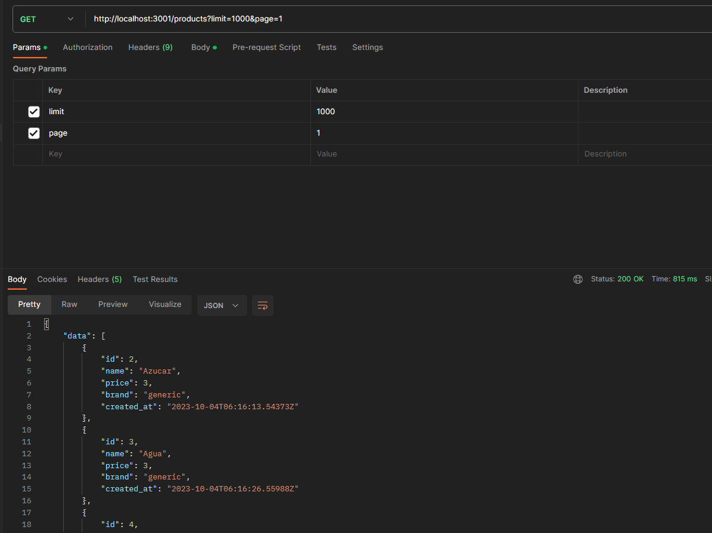

Este es el resultado de alrededor de 3 meses intenso de leer este libro: Apress_Pro_Go_The_Complete_Guide_to_Programming_Reliable_and_Efficient.pdf
Constantemente y llegar construir este framework basdo en arquitecturas limpias. para aplicaciones robustas
Stack: Golang, Fiver, Validator go
TODO
- Dependency injection OK
- Load ENVS OK
- Create structure using modules OK
- Apply the use of interfaces for methods OK
- Libreria de validaciones de data OK
- Configurar un ORM (Opcional)
- Ver como embeber Swagger para cada endpoint OK
- Conversion - Validacion de data, params, queryParams, body, al handler OK
- Validacion de autenticacion, Autorizacion TOKEN (Sessiones - Gorilla libreria) NO
- Crear 2 modulos con get y paginacion OK
- Conexion con base de datos prosgresql, aplicar el uso de contexto OK
```
    create table products(
        id BIGSERIAL not null,
        name varchar(100) not null,
        price float not null,
        brand varchar(50) default 'generic',
        created_at timestamp default now(),
        primary key (id)
    );

    create table users(
        id BIGSERIAL not null,
        name varchar(100) not null,
        email varchar(100) not null,
        age int null,
        created_at timestamp default now() ,
        primary key (id)
    );
```
- Crear despliegue usndo dockerFile Luego se mira
- Configuracion Swagger NO

TODO Futuro:
- Mi objetivo era construir este template en arquitectura hexagonal, con una estructura de carpetar orgenada e inyeccion de dependencias y asi se hizo
- A futuro me gustaria crear un MVC sencillo siguiendo este patron para ser mas agil

TEST ENDPOINTS

```
2023/10/04 02:47:25.430072 app.go:22: [Info] POST products/
2023/10/04 02:47:25.430072 app.go:22: [Info] GET products/
2023/10/04 02:47:25.430622 app.go:22: [Info] POST users/
2023/10/04 02:47:25.430676 app.go:22: [Info] GET users/
```
Prueba: Que bello quedó esto.
